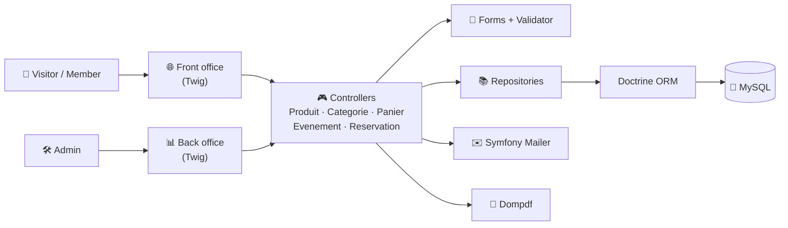
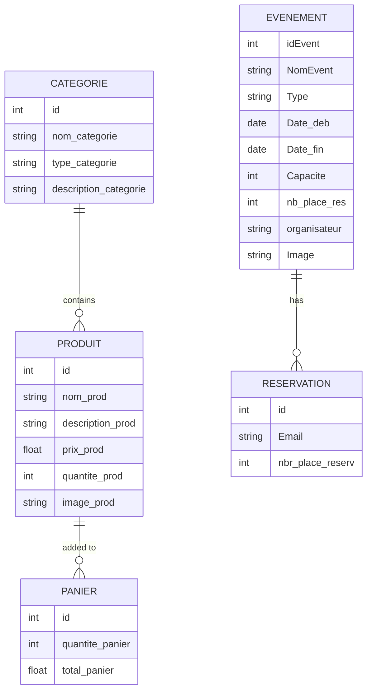

<div align="center">

# ⚽ Bourlafourm

**A sports club web platform with an online shop, events, and ticket reservations, plus a full admin back office.**


</div>

---

## 📖 Table of Contents

- [Overview](#-overview)
- [Features](#-features)
- [Architecture](#-architecture)
- [Data Model](#-data-model)
- [Tech Stack](#-tech-stack)
- [Project Structure](#-project-structure)
- [Getting Started](#-getting-started)
- [Main Routes](#-main-routes)
- [Branches](#-branches)
- [Contributors](#-contributors)

---

## 🌟 Overview

**Bourlafourm** is a web platform for a sports club. Fans and members can **shop for club products**, **discover events**, and **book places**, while administrators manage the catalog, events, and reservations from a dedicated **back office**.

It is built with **Symfony 5.4** and **Doctrine ORM** on **MySQL**, with server-side rendering in **Twig**. The app has two interfaces:

- **Front office**: the public site for visitors and members
- **Back office**: the admin dashboard

---

## ✨ Features

### 🛍️ Shop: products & categories

| | Feature |
|---|---|
| 📦 | Full product CRUD in the back office (name, description, price, stock, image) |
| 🗂️ | Product categories with CRUD |
| 🔎 | Product search in the front and back offices |
| ↕️ | Sort products by price, ascending or descending |
| 📄 | Paginated product listing (KnpPaginator) |
| 📊 | Product statistics |
| 🛒 | **Shopping cart**: add or remove products with an automatic total |

### 🎟️ Events & reservations

| | Feature |
|---|---|
| 📅 | Event CRUD with capacity, dates, type, organizer, and image |
| 🗓️ | **Interactive calendar**: drag and drop to reschedule an event |
| 📈 | Event statistics dashboard |
| 🃏 | Event cards for visitors with pagination |
| ✅ | **Online reservation** with seat count and live seat tracking |
| ✉️ | **Email confirmation** of each reservation (Symfony Mailer) |
| 🧾 | **PDF generation** for events (Dompdf) |
| 📋 | "My reservations" page with cancellation |

---

## 🏗 Architecture

Bourlafourm follows Symfony's standard **MVC** structure.



---

## 🗃 Data Model



---

## 🛠 Tech Stack

| Layer | Technology |
|---|---|
| Language | PHP 8 |
| Framework | Symfony 5.4 (Forms, Validator, Security, Mailer, Twig) |
| ORM / database | Doctrine ORM 3 + Migrations, MySQL |
| Pagination | KnpPaginatorBundle |
| PDF | Dompdf |
| Front end | Twig, Bootstrap, jQuery, FullCalendar, Chart.js |
| Testing | PHPUnit |

---

## 📂 Project Structure

```
.
├── config/                 # Bundles, packages, routes, services
├── migrations/             # Doctrine migrations
├── public/                 # Web root (assets, uploads)
├── src/
│   ├── Controller/         # Produit, Categorie, Panier, Evenement, Reservation, Index
│   ├── Entity/             # Doctrine entities
│   ├── Form/               # Symfony form types
│   └── Repository/         # Custom queries
├── templates/
│   ├── Front/              # Public site (shop, cart, events, reservations)
│   └── Back/               # Admin dashboard (products, categories, events, stats)
├── tests/
└── ProjetWeb/              # Earlier standalone version of the shop module
```

---

## 🚀 Getting Started

### Prerequisites

- PHP **8.0+** with the `pdo_mysql`, `intl`, and `gd` extensions
- [Composer](https://getcomposer.org/)
- MySQL or MariaDB (for example through XAMPP or WAMP)
- [Symfony CLI](https://symfony.com/download) (recommended)

### 1. Clone

```bash
git clone https://github.com/achreflajmi/Bourlafourm-SYMFONY.git
cd Bourlafourm-SYMFONY
```

### 2. Install dependencies

```bash
composer install
```

### 3. Configure your environment

Create a **`.env.local`** file (never committed) and set your own values:

```env
DATABASE_URL="mysql://root:@127.0.0.1:3306/bourlafourm"
MAILER_DSN=null://null
APP_SECRET=change-me
```

### 4. Create the database

```bash
php bin/console doctrine:database:create
php bin/console doctrine:migrations:migrate
```

### 5. Run

```bash
symfony serve
# or
php -S localhost:8000 -t public
```

Open **http://localhost:8000/indexFront** for the public site and **http://localhost:8000/indexBack** for the admin dashboard.

---

## 🧭 Main Routes

<details>
<summary><b>🌐 Front office</b></summary>

| Route | Description |
|---|---|
| `/indexFront` | Home page |
| `/produits` | Product catalog (paginated) |
| `/searchProduit` | Product search |
| `/panier` | Shopping cart |
| `/EvenementsClientCards` | Upcoming events |
| `/reservation/new/{id}` | Book an event |
| `/MesReservations` | My reservations |

</details>

<details>
<summary><b>🛠️ Back office</b></summary>

| Route | Description |
|---|---|
| `/indexBack` | Admin dashboard |
| `/AfficherProduit` | Manage products (sort, search, stats) |
| `/AfficherCategorie` | Manage categories |
| `/ListEve` | Manage events |
| `/evenement/new` | Create an event |
| `/calendar/events` | Event calendar (JSON feed) |
| `/Stat` | Event statistics |
| `/event/{id}/generate-pdf` | Export an event as a PDF |

</details>

---

## 🌿 Branches

Each module was developed on its own branch:

| Branch | Module |
|---|---|
| `Gestion_produit` *(default)* | Shop, cart, and the merged events module |
| `Branche_Evenement` | Events & reservations |
| `Gestion_user` | User management |
| `Gestion_soins` / `G_soins` | Care and wellness services |
| `GestionDesPaques` | Packs |

---

## 👥 Contributors

- [**Achref Lajmi**](https://github.com/achreflajmi)
- **Melek hamadi**
- **oumasaadi**

---

<div align="center">

Built with ❤️ and Symfony.

</div>
